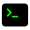

<h1 align="center">
  ¡Bienvenidos a mi GitHub!
  
</h1>

<!-- * -->

	<!--  -->
	
	
	
	<!-- 
	
	 -->

<!-- * -->

### Me alegro de verte... 

Soy <a href="">Fernando Sosa</a>,
desarrollador Front-End de

<b>Córdoba, Argentina</b>.

<!-- * SKILLS -->

<!-- ### <b> Skills</b> -->

### <b> Front-End</b>     

### <b> Back-End</b>     

### <b> Herramientas</b>     

<!-- 

    
    
    
    
    
    
    
    
    
    
    
    
    
    
    

 -->
