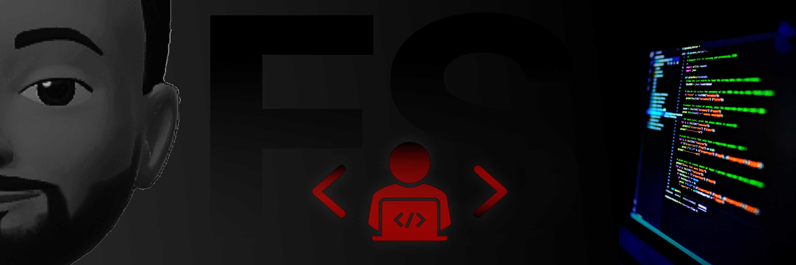

<h1 align="center">
  ¡Bienvenidos a mi GitHub!
  
</h1>

<!-- * -->

	
	
	

<!-- * -->

### Me alegro de verte... 

 <!--    -->

Soy <a href="">Fernando Sosa</a>,
desarrollador Fron-End de

<b>Córdoba, Argetina</b>.

<!-- - SKILLS -->

### <b> Skills</b>

<!--   -->

<!-- ### <b> Lenguajes</b> -->

    
    
    
    

